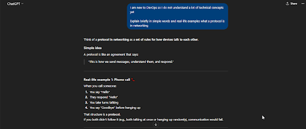
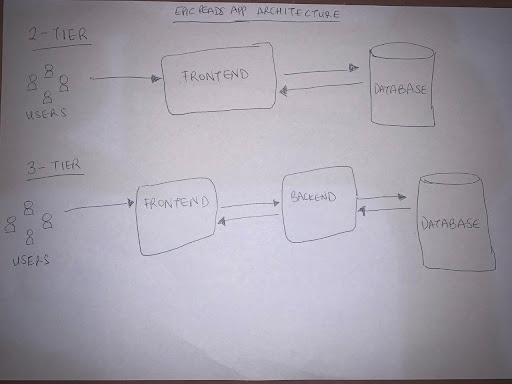
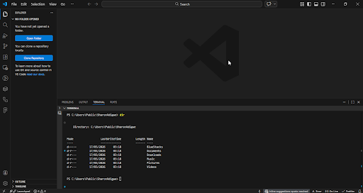

# Week 00 - Internet and Networking

Part of the DevOps Micro Internship (DMI) Cohort 3 with Agentic AI

---

# 🧑‍💻 Task 1: Using ChatGPT as Your Learning Assistant

## Scenario

You're new to DevOps and will frequently encounter technical questions. ChatGPT can be your learning companion.

## Your Task

Write a clear ChatGPT prompt to help you understand:

> "What is a protocol in networking? Explain with a simple real-life example."

Take a screenshot of your interaction showing:

* Your detailed prompt (with clear expectations)
* ChatGPT's simplified response with an example

## Screenshot




---

## What I Learned (2–3 lines)

I learnt a better way to prompt AI models like ChatGPT to explain concepts and help me learn easier is by providing proper context so it gives a response I can understand.

---

# 🌐 Task 2: Internet and Networking

## Scenario

Your friend is launching an online bookstore named **EpicReads**.

He asked you to explain how users globally can access his website hosted in Finland.

## Your Task

Write a short explanation (**100–150 words**) that includes:

* Packet Switching
* IP Address
* TCP/IP
* HTTP/HTTPS

💡 **Tip:** You may use ChatGPT (as demonstrated in Task 1) to refine your explanation.

## Answer

The Internet is an interconnection of networks. ISPs are connected globally using fibre cables, so data can be transmitted around the world. When data is transmitted, Packet Switching is used. If a user sends a request from their browser to the server in Finland, this request is split into small packets, each taking different paths, and all are reassembled at the final destination.
Data transmission over networks is governed by protocols. The Internet Protocol (IP) handles addressing and routing of data. Every node connected to the Internet has a specific IP address that tells the packets where to go and where to return. The Transmission Control Protocol (TCP) ensures the packets received are complete and in order.
HTTP/HTTPS allow data transmission between a browser and web server. HTTPS enforces secure data transmission between EpicReads’ server and the user’s browser, so users anywhere can use the site safely.


---

# 🏗️ Task 3: Application Architecture & Stack

## Scenario

EpicReads bookstore has two application versions:

### Two-Tier Application

* Frontend
* Database

### Three-Tier Application

* Frontend
* Backend
* Database

## Your Task

* Draw simple diagrams (hand-drawn or tool-based such as draw.io)
* Label each layer clearly
* List at least two common technologies or tools used for each layer
* Submit a screenshot or photo clearly showing your own drawing

## Diagram Screenshot / Photo




---

## Technologies Used

### Frontend

* Tailwind
* Next.js
* React.js
* Zustand

### Backend

* Django
* Node.js
* JWT
* bcrypt.js

### Database

* MongoDB
* MySQL
* PostgresSQL

---

# 🌍 Task 4: Domain Name & DNS (Basic Concepts)

## Scenario

Your friend's bookstore **EpicReads** is currently accessible through:

```text
52.172.142.222:3000
```

He purchased the domain:

```text
epicreads.com
```

## Your Task

In **50–100 words**, explain in your own words:

1. What is DNS (Domain Name System)?
2. Which DNS record type should be used to connect the domain to the given IP, and why?

## Answer

Domain Name System (DNS) is the Internet’s phonebook. It translates human-readable addresses into IP addresses that devices understand, so users do not need to memorize the IP address numbers.  
To connect the domain, epicreads.com, to the IP 52.172.142.222:3000, an A Record should be used. It is the DNS record type used to point a specific domain name to a specific IPv4 address. Once this is done, typing epicreads.com in a browser will direct the user to that IP.


---

# 💻 Task 5: Visual Studio Code Setup (Hands-on)

## Your Task

Install Visual Studio Code (if not already installed).

Take a screenshot of your VS Code environment showing:

* Terminal open inside VS Code
* Running a basic command:

### Windows

```powershell
dir
```

### Linux / macOS

```bash
pwd
ls
```

* Your selected VS Code theme clearly visible

⚠️ **Important:** The screenshot must show your username or another identifiable detail to confirm it is your environment.

## Screenshot




---

# 🔗 Task 6: Publish Your Assignment as a LinkedIn Post

## Objective

Publishing on LinkedIn helps you:

* Build your professional online presence
* Reinforce your learning
* Document your DevOps journey publicly

## Your Task

Summarize your answers from Tasks 1–5 into a LinkedIn post.

Clearly structure your post into the following sections:

* ChatGPT
* Internet & Networking
* App Architecture
* DNS
* VS Code Setup

Add the following credit note at the end of your post:

> **P.S. This post is a part of DevOps Micro Internship with Agentic AI Cohort-3 by Pravin Mishra. You can start your DevOps journey by joining this Discord community: https://discord.pravinmishra.com/**

---

## LinkedIn Post URL

Paste your LinkedIn post URL here:

```text
https://www.linkedin.com/posts/sharon-adigwe_devopsjourney-learninginpublic-activity-7439516059910709248-wwKj?utm_source=share&utm_medium=member_desktop&rcm=ACoAADnEfwgB-JM6aw9pi7zIZW_86SUrQoXVmcY
```

---

## LinkedIn Post Backup Copy

In a bid to reinforce and improve my skills in DevOps this year, I have decided to apply for the DMI Cohort 3 starting in May.

We were asked to complete initial tasks to test basic knowledge on internet and networking, app architecture, use of AI, DNS, and VS code setup. Here's a recap of my work.

1. ChatGPT
I crafted a precise prompt to explain "What is a protocol in networking?" requesting simplicity, and a real-life example (like a phone call), making the response easier to grasp and comprehend.

2. Internet & Networking
I explored the process behind browsing epicreads.com. User's request is fragmented into packets via packet switching and routed dynamically across global networks for efficiency. TCP/IP ensures reliable transmission (error-checking, reassembly), while HTTP/HTTPS handles content delivery between the browser and server - HTTPS layering on encryption for security.

3. App Architecture
I mapped out EpicReads' app layers: 
Two-tier (Frontend directly to DB) which suits quick prototypes but lacks scalability. 
Three-tier (Frontend → Backend API → Database) adds security and modularity for growth, a go-to for robust, production-ready bookstore apps. Also, created diagrams to visualize connections and identified tools to be used for each layer (e.g. Next.js for FE).

4. DNS
I described DNS as the web's phonebook, converting user-friendly domains like epicreads.com to machine-readable IP addresses. Here, creating an A record is key as it directly links the domain to the IPv4 address, bypassing raw IP access and making the site accessible when deployed.

5. VS Code Setup
I mastered VS Code's terminal for seamless DevOps workflows. This setup streamlines coding, debugging, and CLI tasks turning VS Code into an all-in-one powerhouse for efficient development.

P.S. This post is part of the FREE DevOps Micro Internship Cohort run by Pravin Mishra. You can start your DevOps journey for free from his YouTube Playlist.

hashtag#DevOpsJourney
hashtag#LearningInPublic

---

# Reflection – Week 0

### What did you find easy?

As someone with some developer experience, I found it easy to understand the networking concepts and VS code setup.

---

### What was difficult?

I would not say it was difficult, but the part on DNS reminded me of some forgotten concepts like the DNS Resolution process.

---

### What will you improve next week?

I hope to personally apply the lessons on app architecture practically in deploying applications.

---

## 📌 About DMI & CloudAdvisory

DevOps Micro Internship (DMI) is a project-based DevOps program run by Pravin Mishra (The CloudAdvisory) focused on real-world execution, systems thinking, and career readiness.

It helps learners build strong DevOps foundations with hands-on experience.


## 📌 Resources

- 🌐 **DMI Official Website:** https://pravinmishra.com/dmi  
- 🎓 **DevOps for Beginners (Udemy):** https://www.udemy.com/course/devops-for-beginners-docker-k8s-cloud-cicd-4-projects/  
- 🎓 **Ultimate Agentic AI DevOps with Clude Code** https://www.udemy.com/course/ultimate-agentic-ai-devops-with-claude-code/?referralCode=448389767BC96284087B
- 🎓 **DevOps with Claude Code: Terraform, EKS, ArgoCD & Helm** https://www.udemy.com/course/devops-with-claude-code-terraform-eks-argocd-helm/?referralCode=1C5B734505D65A010FA3
- ▶️ **YouTube Playlist (DMI Cohort 3):** https://www.youtube.com/playlist?list=PLFeSNDtI4Cho  
- 🔗 **Pravin Mishra (LinkedIn):** https://www.linkedin.com/in/pravin-mishra-aws-trainer/  
- 🏢 **CloudAdvisory (LinkedIn):** https://www.linkedin.com/company/thecloudadvisory/

---

*This submission is part of DevOps Micro Internship (DMI) Cohort 3 — Agentic AI Track*